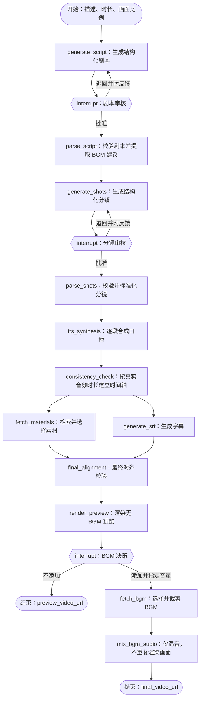

# 后端技术规范

## 1. 职责与目标

后端负责用户与任务数据、LangGraph 工作流编排、人工审核恢复、模型及媒体供应商适配、时间轴计算、渲染编排和产物授权访问。实现前必须阅读根目录 `AGENTS.md`；新增或修改接口时同时阅读并维护 `agents/api.md`。

后端设计优先级为：可恢复性与幂等性、数据和权限安全、时间轴正确性、错误可诊断性，最后才是吞吐量优化。

## 2. 分层与依赖边界

在不破坏既有结构的前提下，保持以下职责分离：

- API 层：认证、输入校验、状态码和 DTO 转换，不编排媒体处理细节。
- 应用层：创建任务、提交审核、查询历史、删除任务等用例。
- 工作流层：GraphState、节点、条件边、interrupt/resume 和状态归并。
- 领域层：剧本、分镜、时间轴、审核决策、任务状态等模型与规则。
- 基础设施层：SQLite、LangGraph Checkpointer、LLM、TTS、Pexels、文件/对象存储和渲染器适配器。

路由不得直接调用供应商 SDK；LangGraph 节点不得依赖 HTTP 请求对象；领域模型不得导入具体供应商实现。外部服务通过小型、可替换且可 mock 的接口接入。

## 3. 短视频生成工作流

目标流程如下。节点名称可随代码结构调整，但状态转换和人工审核语义必须保持清晰：

不得因实现方便跳过剧本审核、分镜审核或预览后的 BGM 决策。修改流程拓扑、状态字段或恢复协议时，必须补充图分支测试并同步接口文档。

## 4. GraphState 与节点契约

GraphState 使用 `TypedDict`、dataclass 或 Pydantic 等明确类型，并区分以下信息：

- 身份与输入：`task_id`、`user_id`、主题描述、目标时长、画面比例。
- 工作产物：剧本版本、分镜版本、TTS 片段、素材选择、字幕、时间轴、预览和最终视频引用。
- 审核信息：审核类型、当前版本、决策、反馈、操作者和时间。
- 执行信息：当前阶段、重试次数、供应商调用元数据、安全错误、创建和更新时间。

状态中只保存可序列化的小型数据。音频、视频、图片和大型供应商响应写入受控存储，状态仅保存引用、校验值、时长和必要元数据。禁止把密钥、连接对象、文件句柄、异常对象或原始二进制放入检查点。

每个节点必须遵守：

- 输入和输出字段明确，只返回本节点负责的增量，不复制或覆盖无关状态。
- LLM 输出先用结构化输出约束，再经 Pydantic 校验；不得用脆弱的字符串切割代替解析。
- 可重试的外部调用设置超时、有限重试和退避；校验错误与永久错误不得盲目重试。
- 具有外部副作用的节点必须幂等。以 `task_id + node + artifact/version` 形成稳定幂等键，恢复或重跑时复用已完成产物。
- 失败记录阶段、错误类别、是否可重试和脱敏上下文；对外不暴露堆栈、内部路径或供应商响应中的敏感字段。
- 并行分支写入不同字段；汇合字段必须定义 reducer 或显式聚合规则，避免非确定覆盖。

## 5. 人工审核与恢复

- 每个任务使用稳定的 LangGraph `thread_id`，并与应用任务及用户所有权绑定。
- `interrupt` 载荷包含审核类型、待审版本、可展示内容和允许动作，不包含密钥或媒体二进制。
- 恢复命令使用明确结构，例如 `action: approve | reject` 和可选 `feedback`。退回时反馈必填；批准时不得复用旧反馈。
- 审核提交必须校验用户所有权、任务当前阶段和版本号。过期或重复提交返回冲突，不重复执行下游节点。
- 每次退回生成新版本并保留审核历史，不覆盖已经批准或被退回的版本。
- 检查点写入和业务状态更新应有清晰的一致性策略；进程重启后能从最后一个安全检查点继续。
- 中断不是失败。API 和历史记录应把“等待剧本审核”“等待分镜审核”“等待 BGM 决策”表示为可操作状态。

## 6. 剧本、分镜与时间轴规则

- 剧本和分镜输出必须符合版本化结构模型，至少包含稳定片段/镜头 ID、文本、顺序和预计时长。
- 目标总时长是约束，不应靠截断最后一句满足。生成阶段估算，TTS 后使用真实音频时长重新计算。
- TTS 按稳定片段 ID 生成，记录音频时长、采样信息、供应商和产物引用；单段重试不得使其他片段重复生成。
- 时间轴统一使用整数毫秒或项目约定的单一精度进行内部计算，API 单位必须在文档中明确。避免跨步骤反复浮点舍入。
- 每个镜头、配音、素材和字幕区间必须可追溯到稳定 ID。区间不得为负、倒置或产生未解释的重叠。
- SRT 基于最终口播时间轴生成，序号连续、时间单调且结束时间不超过最终视频时长。
- `final_alignment` 必须验证素材覆盖、字幕边界、音频总长、画面总长和目标比例；失败时返回可定位的校验问题，不把错误带入渲染。

## 7. 素材、TTS、BGM 与渲染适配

- LLM、TTS 和素材源的模型名、端点、凭据从服务端环境配置读取。业务代码只依赖适配器接口。
- Pexels 为默认素材源，但搜索、下载、许可/署名元数据和缓存应封装，便于替换供应商。
- 素材查询词来源于已批准分镜；记录素材来源、原始 ID、作者/许可信息、下载时间和选用镜头。
- 下载远程资源前校验 HTTPS、允许的域名、响应类型、大小、超时和重定向，防止 SSRF 与资源耗尽。
- 所有中间文件写入任务专属工作目录；文件名由服务端生成，禁止直接采用用户输入或远程响应文件名。
- 渲染调用使用参数数组或受控 SDK，不拼接 shell 字符串。记录可复现的渲染清单，但不记录密钥。
- 预览视频不含 BGM。用户选择添加时应在预览成品上进行音频混合，除非画面参数确实变化，不重复渲染视频轨。
- BGM 音量使用单一且有边界的单位，执行响度控制和防削波处理；裁剪、淡入淡出策略应可测试且记录在渲染清单中。
- 删除任务时按产品定义处理数据库记录和媒体产物，必须校验所有权，并避免跟随符号链接删除任务目录外的文件。

## 8. 用户、配置与持久化

- 注册邮箱规范化并建立唯一约束；密码只保存经成熟密码哈希算法生成的哈希，不自行设计加密方案。
- 登录、审核、历史、预览、导出和删除接口都必须鉴权；按 `user_id` 过滤并再次校验资源所有权。
- 会话 Cookie/令牌采用安全过期策略。认证失败响应不得泄露邮箱是否存在、哈希细节或内部异常。
- 普通用户设置只能保存非敏感偏好，例如允许的模型选项、默认比例和 BGM 音量；不得让请求直接改写服务器 `.env`。
- LLM、TTS、Pexels 凭据属于部署级配置。如未来提供在线凭据管理，必须限定管理员、加密保存、响应掩码、写入审计，并与普通用户设置隔离。
- 应用业务表和 LangGraph 检查点职责分离。SQLite 启用合适的外键、事务和忙等待策略；结构变化使用迁移，不在启动时静默破坏数据。
- 历史记录至少能追溯任务状态、输入摘要、创建/更新时间、当前阶段和产物引用；敏感提示内容是否保存应遵循产品隐私策略。

## 9. API 规则

- 每一个新增或变更的接口都必须在 `agents/api.md` 中定义方法、路径、认证、请求、响应、状态码和示例。
- API DTO 与 GraphState/数据库模型分离，不直接序列化内部对象。
- 创建任务应返回可稳定查询的任务 ID；重复创建策略需明确幂等键或重复行为。
- 长任务接口不得占用 HTTP 请求直至渲染完成。使用任务查询加轮询，或文档明确的 SSE/WebSocket 推送。
- 审核与 BGM 决策接口必须携带当前版本或并发控制信息，状态不匹配时返回 409。
- 输入校验覆盖描述长度、目标时长范围、画面比例枚举、反馈长度、音量范围、分页和资源 ID 格式。
- 列表接口必须分页并稳定排序；媒体预览和下载使用授权接口或短时签名 URL，不暴露任意本地路径。

## 10. 可观测性与错误处理

- 每次请求和工作流运行使用可关联的 `request_id`、`task_id` 和安全的 `thread_id`，日志字段结构化。
- 记录节点开始、完成、耗时、重试和产物 ID；不要记录完整提示词、完整模型响应、认证信息或媒体内容。
- 区分领域校验错误、权限错误、状态冲突、供应商暂时故障、配额错误和内部错误，并映射到稳定错误码。
- 临时故障可从安全节点重试；永久错误进入明确失败状态。不得出现无限重试或无上限审核循环造成的资源泄漏。
- 对外部供应商设置并发、速率、超时和成本边界；取消任务后尽快停止尚未开始的工作并清理可安全清理的临时资源。

## 11. 测试与完成标准

测试不得调用真实付费服务。为 LLM、TTS、Pexels、存储和渲染器提供确定性的 fake/mock，并覆盖：

- GraphState 与结构化输出校验。
- 剧本批准/退回、分镜批准/退回及版本冲突。
- BGM 的 `no_add` 和 `add` 两条结束分支。
- 检查点恢复、节点重试和幂等副作用。
- 素材与字幕并行分支的正确汇合。
- TTS 实际时长驱动的时间轴、SRT 边界和最终对齐失败。
- 用户隔离、未授权访问、非法路径、恶意 URL、超限输入和日志脱敏。
- API 状态码、DTO 与 `agents/api.md` 契约一致性。

提交前运行受影响范围的格式、静态检查和测试。涉及完整流程时至少增加一个使用 fake 供应商的端到端工作流测试。若环境或尚未实现的入口导致无法验证，应在交付中准确说明；同时检查接口文档和 `README.md` 是否需要同步。
